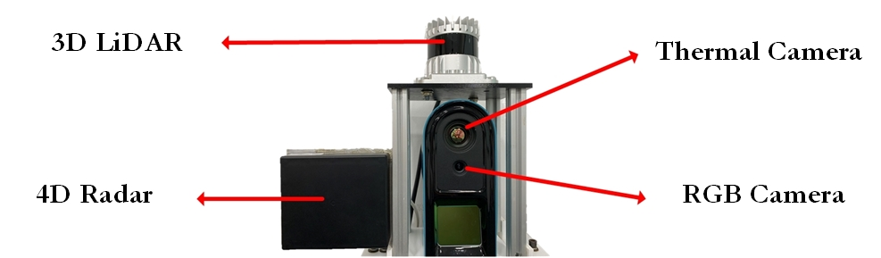

# ThermRad Dataset

This repository provides a description of ThermRad which is currently still under construction.

## Overview

## Data Collection 

 
<b>Data collection platform.</b>

 

 
<b>Data collection process.</b>

daytime

nightime

rain

# Data Annotation #

daytime

nightime

rain

