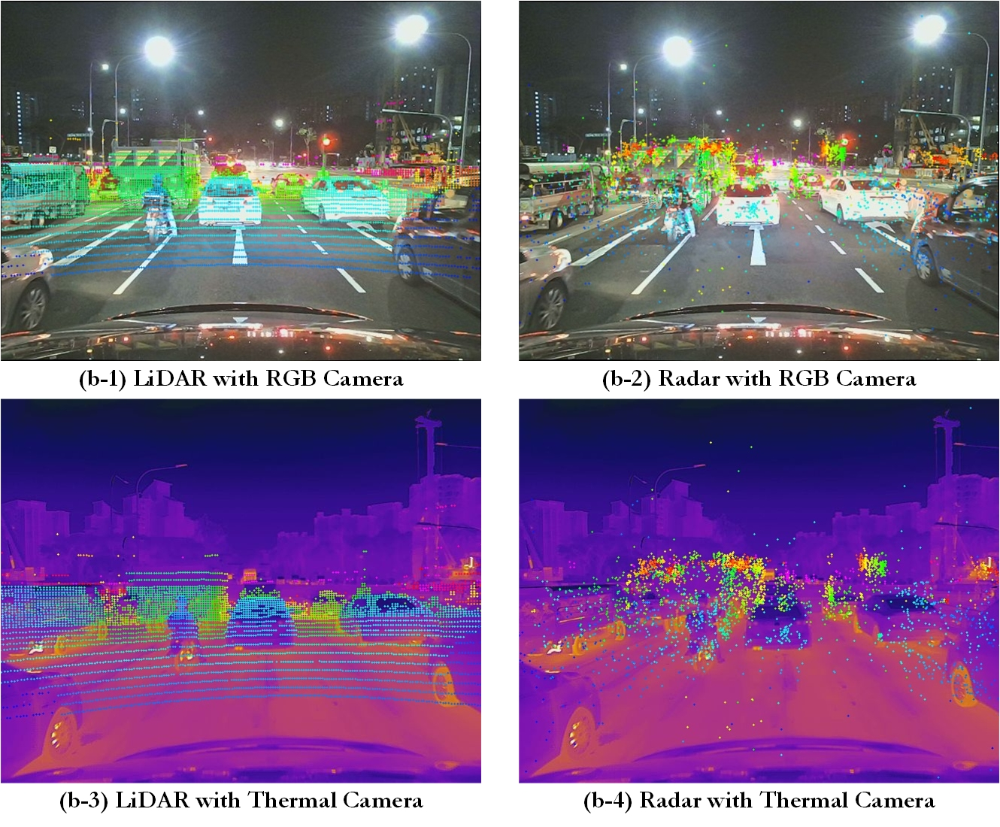

# ThermRad Dataset

This repository provides a description of ThermRad which is currently still under construction.

## Overview
- [Introduction](#introduction)
- [Data Collection](#data-collection)
- [Access_License](#access_license)
- [Acknowledgement](#acknowledgement)
- [Citation](#citation)
 

## Introduction

## Data Collection 

 
<b>Data collection platform</b>

 

 
<b>Sensor Calibration</b>

 

 
<b>Data collection process</b>

 
<b>Data annotation</b>

